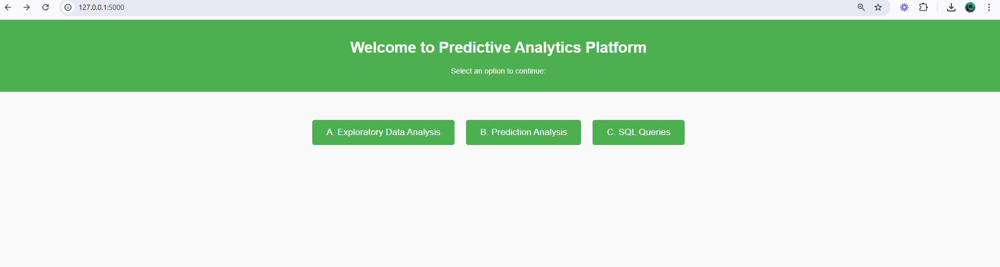
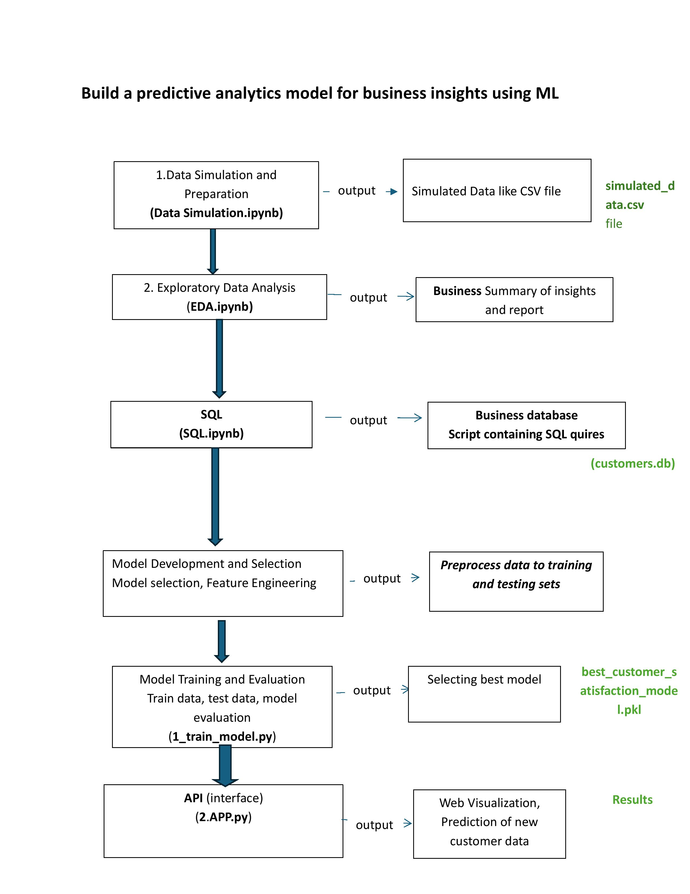

# Build a Predictive Analytics Model for Business Insights Using ML

## Project Overview
The project "Build a Predictive Analytics Model for Business Insights Using ML" focuses on developing a comprehensive machine learning (ML)-based solution to generate actionable business insights. The primary objective is to leverage predictive analytics to analyze customer data and provide data-driven recommendations for enhancing business strategies and decision-making processes.

## Objectives
- Simulate and preprocess data to replicate real-world customer scenarios.
- Perform exploratory data analysis (EDA) to uncover trends, patterns, and actionable insights.
- Build and evaluate machine learning models to predict key business outcomes, such as customer satisfaction or behavior.
- Deploy a user-friendly interface to allow visualization and real-time predictions.

## Project Workflow

### 1. Data Simulation and Preparation
- **File/Script**: `Data Simulation.ipynb`
- **Output**: A CSV file named `simulated_data.csv` containing the generated data.
- **Objective**: Simulated customer data was created to mimic real-world scenarios, ensuring a controlled and reproducible environment for analysis. This data serves as the foundation for subsequent EDA and model development.

### 2. Exploratory Data Analysis (EDA)
- **File/Script**: `EDA.ipynb`
- **Output**: A business report summarizing insights and findings.
- **Objective**:
  - Conducted EDA to explore the simulated dataset, identify meaningful patterns, and generate insights into customer behavior and business metrics.
  - This phase helped shape the problem statement and define the scope of the predictive model.

### 3. Data Structuring with SQL
- **File/Script**: `SQL.ipynb`
- **Output**: A database (`customers.db`) and a script containing SQL queries.
- **Objective**: SQL queries were utilized to process and organize the data into a structured business database, enabling efficient data manipulation and analysis.

### 4. Machine Learning Model Development
- **File/Script**: Models were developed using various algorithms, including regression, decision trees, and neural networks.
- **Output**: Preprocessed datasets for training and testing the models.
- **Objective**:
  - Feature engineering was performed to enhance the quality of input data.
  - Multiple machine learning models were developed to predict business-critical outcomes like customer satisfaction.
  - The best-performing model was selected based on evaluation metrics such as accuracy, precision, and recall.

### 5. Model Training and Evaluation
- **File/Script**: `1_train_model.py`
- **Output**: A serialized model file (`best_customer_satisfaction_model.pkl`).
- **Objective**:
  - The selected model was trained and tested on preprocessed datasets to ensure robust performance and generalizability.
  - The finalized model was serialized for deployment.

### 6. API and Interface Development
- **File/Script**: `2_APP.py`
- **Output**: A web interface providing visualization and prediction capabilities for new customer data.
- **Objective**:
  - An API-based web interface was built to enable seamless user interaction with the model.
  - The interface includes tools for data visualization and real-time prediction of new customer data, making the model accessible and actionable for end-users.

## Final Deliverables
- **Simulated Data File**: `simulated_data.csv`
- **Database**: `customers.db`
- **Trained Model**: `best_customer_satisfaction_model.pkl`
- **Results**: Predictions and visualizations accessible via the API interface.


## Screenshots


## Requirements
To run the project, ensure you have the following installed:

- Python 3.8+
- Libraries: `numpy`, `pandas`, `matplotlib`, `seaborn`, `scikit-learn`, `keras`, `sqlite3`, `sqlalchemy`, `shap`, `joblib`

## Dataset
The dataset is simulated using Python libraries such as `numpy` and `pandas`. It includes features like:
- `customer_id`
- `age`
- `income`
- `purchase_history`
- `customer_satisfaction`


## How to Run the Project
1. Clone the repository:
   ```bash
   git clone https://github.com/Lunar-Vibes/ML
   ```
2. Navigate to the project directory:
   ```bash
   cd Ml
   ```
3. Install dependencies:
   ```bash
   pip install -r requirements.txt
   ```
4. Train and evaluate models using the ML script.
	```bash
   python 1_train_model.py
   ```
5. Use the saved model for predictions with the deployment script
	```bash
   python 2_App.py
   ```


## Project Structure
```
├── 1_train_model.py        # Advanced model training script
├── 2_App.py                # API and interface script
├── scripts/                # Python scripts for the project
│   ├── 1. Data simulation.ipynb  # Data simulation script
│   ├── 2.EDA.ipynb             # Exploratory Data Analysis script
│   └── 6. Prediction.ipynb          # Prediction script
├── static/                 # Static files like CSS/JS 
├── templates/              # HTML templates 
├── images/                 # Folder for project-related images
│   └── Project_flow.jpg    # Project flow diagram
├── customer.db             # Database containing structured customer data
├── requirements.txt        # Python dependencies
├── README.md               # Project documentation

```


## Authors
- **Shagufta Shaheen** - *EDA, Model Training,API* - [GitHub Profile](https://github.com/Lunar-Vibes)
- **Eng Kah Hui** - *SQL, Model Training, API* - [GitHub Profile](https://github.com/clarice-eng7117)
- **Jamal Jameel AlShaweai** - *Data Simulation and Preparation, API* - [GitHub Profile](https://github.com/your-profile)

## Acknowledgments
- Inspired by [https://github.com/glowform/intro_python_sql_2024/blob/main/exercises/ex_adv2_ML.ipynb]


## Future Work
- Deploy the model as a web application.
- Add support for real-world datasets.


## Project Flow Diagram

